# Flowchart Aplikasi Perpustakaan (Mermaid)
 
## 1. main, tampilAwal, tampilMenu
 
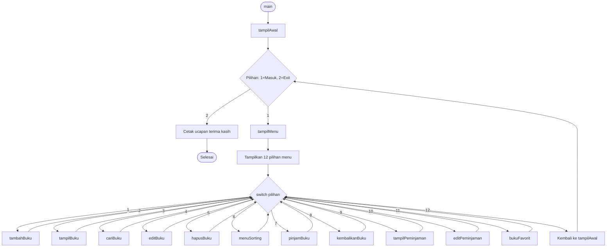
 
## 2. tambahBuku
 
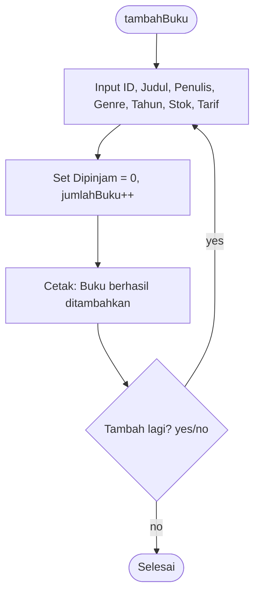
 
## 3. tampilBuku
 
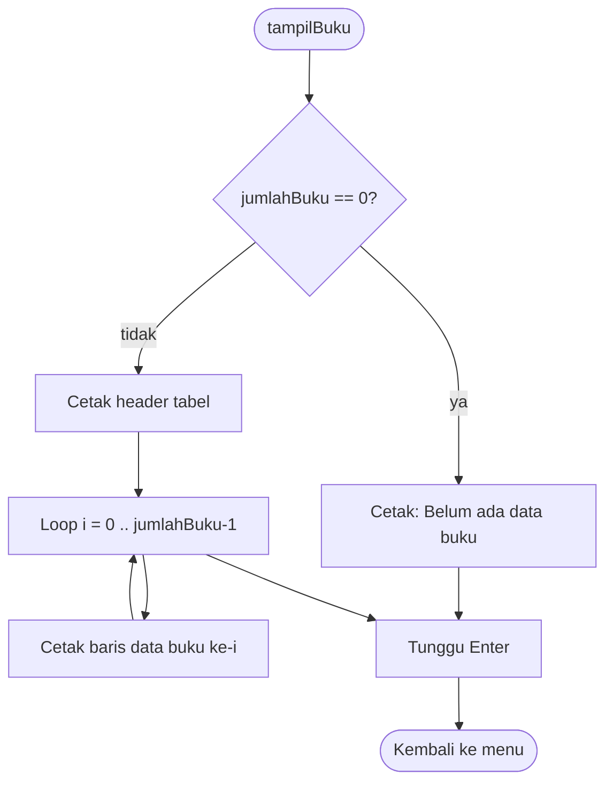
 
## 4. cariBuku, sequentialSearchJudul, binarySearchID, urutkanBukuByID
 
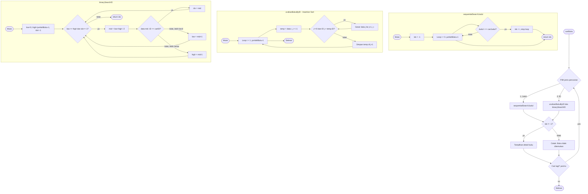
 
## 5. editBuku
 
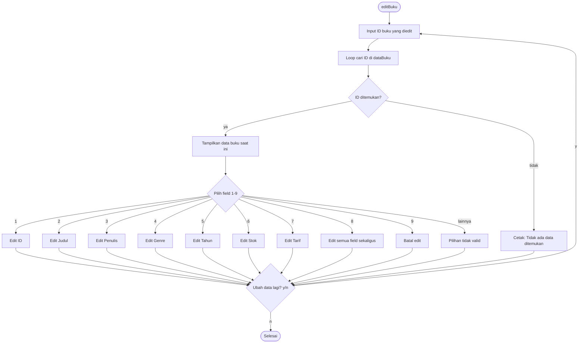
 
## 6. hapusBuku
 
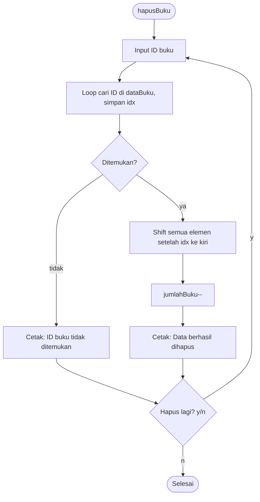
 
## 7. pinjamBuku
 
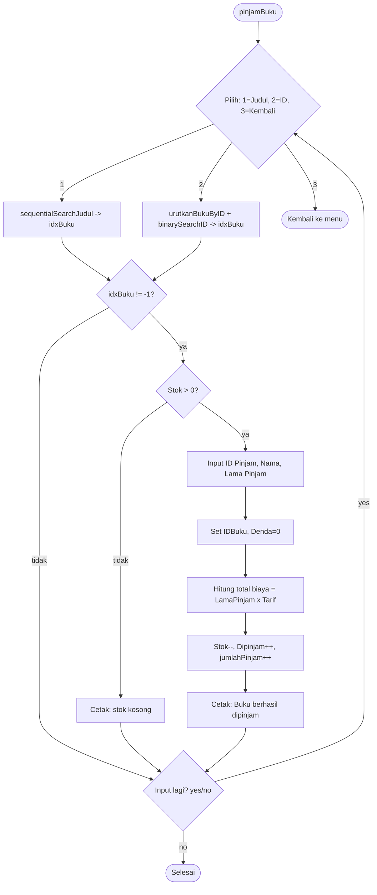
 
## 8. kembalikanBuku
 
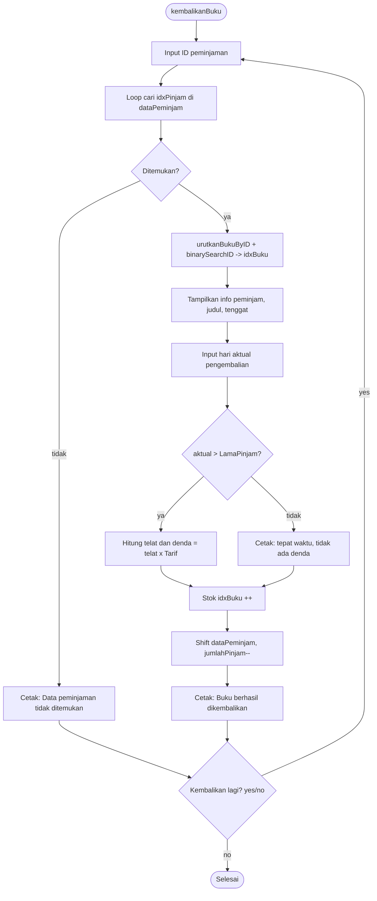
 
## 9. tampilPeminjaman & editPeminjaman
 
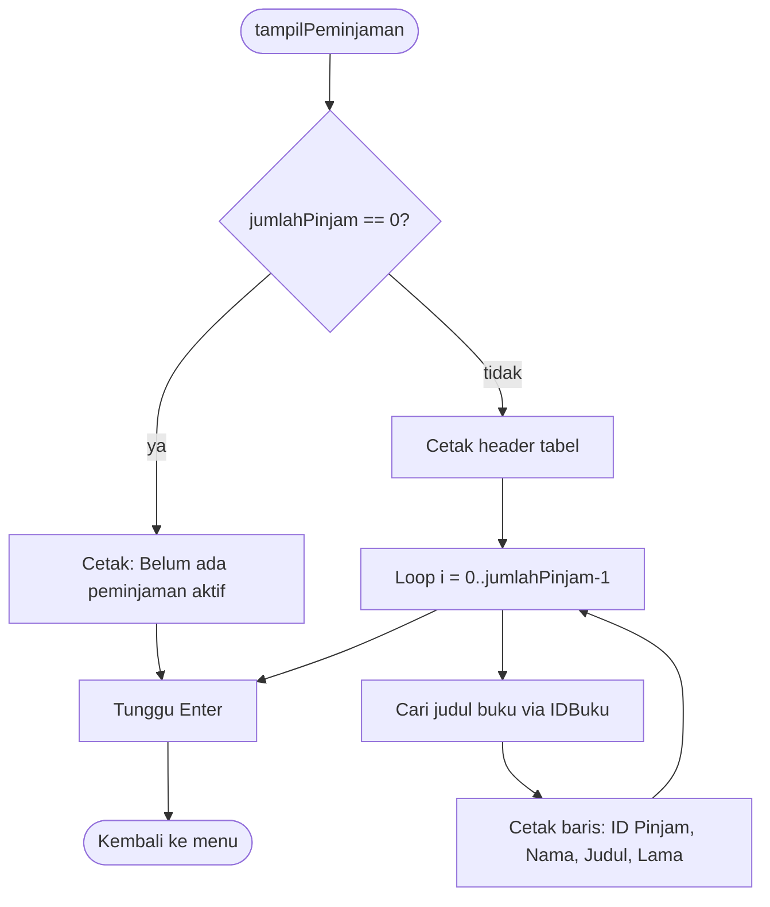
 
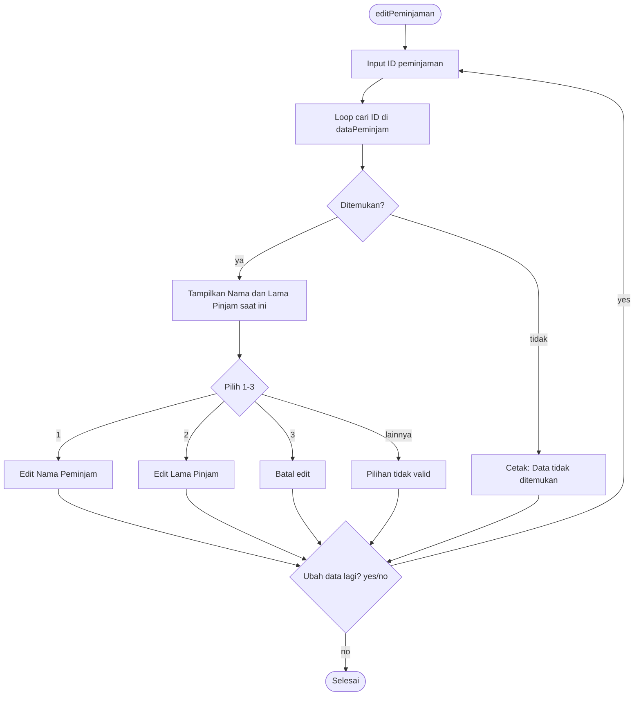
 
## 10. menuSorting & 4 fungsi sort
 
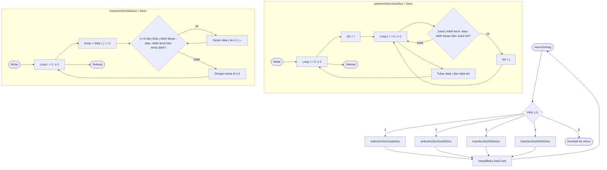
 
## 11. bukuFavorit
 
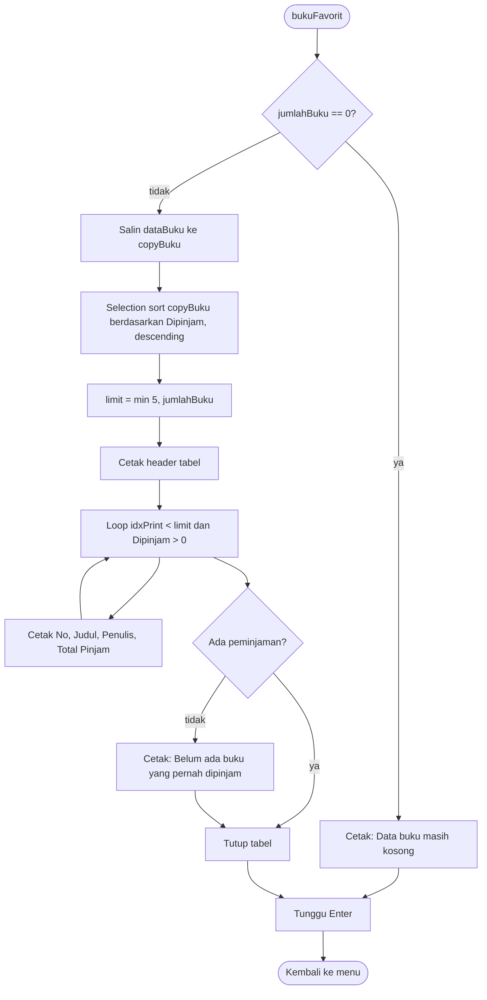